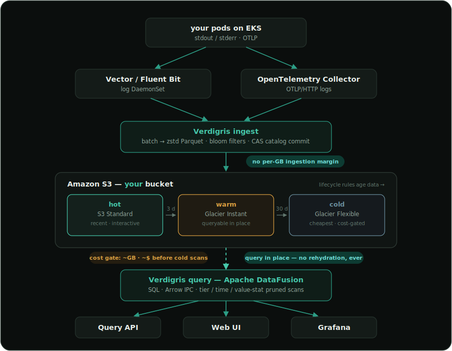

<div align="center">


# Verdigris

**The layer your infrastructure leaves behind.**

An S3-native log storage & query engine in Rust — a self-hostable alternative to
hosted SaaS log platforms that keeps your log data in **your own** cloud account.

[](#testing--deterministic-simulation)
[](https://www.rust-lang.org/)
[](docs/adr)
[](LICENSE)
[](ROADMAP.md)

*Your bucket is the database. One binary, one `helm install`, no surprise bills.*

</div>

---

## Key ideas

- **Your S3 bucket is the database.** Logs land as compacted Parquet in *your*
  account and are queried **in place** — no vendor cloud in the path, no per-GB
  ingestion margin, and an entire class of compliance questions collapses to
  *"it's your bucket."*
- **Cold logs are always live.** Data tiers hot → warm → glacier-cold on S3
  lifecycle rules and stays queryable at every tier — there is **no
  "rehydrate the archive back into an index" step, ever.**
- **No surprise bills.** Before any cold scan runs you see *"this will scan
  ~40 GB from cold storage and cost ~$0.40 — continue?"* — the estimate and the
  executed query provably read the same files.
- **SQL, not a proprietary DSL.** Plus a concise search syntax
  (`service:auth status>=500 | last 1h`) that compiles *to* SQL. Your queries
  stay portable.

## Quick start

```bash
# 1. Start the server (first build pulls DataFusion, ~1.5 min).
cargo run -p vdg --features serve -- serve --table logs

# 2. In another terminal, keep synthetic logs flowing.
cargo run -- ingest --table logs --follow

# 3. Open the UI — query, live-tail, tier costs, alerts, the cold-scan gate.
open http://localhost:8080
```

Fully offline out of the box (local filesystem storage); switch to S3/MinIO in
[`config/verdigris.toml`](config/verdigris.toml) with **no recompile**. Deploying
to Kubernetes + S3 is one `helm install` — see [below](#deploy-on-eks--s3-helm).

## Why this exists

Two things the hosted incumbents structurally *can't* fix without breaking their
own business model:

1. **Data sovereignty.** With Verdigris, bytes go from your pods to your bucket.
   There is no vendor cloud metering an ingestion margin on every GB your
   infrastructure emits, and your data never becomes someone else's asset.
2. **The rehydration tax.** Hosted platforms park old logs in cheap archives —
   then make you *re-index* them (slowly, expensively) before you can search.
   Verdigris reads Parquet straight out of S3 at every tier; you pay compute
   only when you actually query, plus the underlying S3/Glacier retrieval cost,
   which is quoted **before** the scan runs.

One design principle underneath it all: **never price or architect around log
severity.** Storage is priced by bytes in S3; query speed is a separately
provisioned compute dial. Severity decides *placement* (which tier a log lands
in) — never price.

## Features

The full pipeline runs end to end — locally and via Helm:

| | |
|---|---|
| **Ingest** | HTTP NDJSON/JSON (`/v1/ingest`) for Vector & Fluent Bit, native OTLP/HTTP logs (`/v1/otlp/logs`), bounded-memory **backpressure** (413/429) |
| **Store** | zstd Parquet, content-addressed files, **bloom filters** on lookup columns, optimistic **CAS catalog commits** (concurrent writers can't clobber each other) |
| **Tier** | severity → hot/warm/cold prefixes at write time; S3 lifecycle policies generated *and applied* (`vdg lifecycle --apply`) |
| **Compact** | background small-file merge per tier — crash-safe, manifest-first |
| **Query** | Apache DataFusion over Parquet in place; SQL + search DSL; JSON **and Arrow IPC** wire; file-level pruning by tier, time window, and per-file `service`/`level` stats — **shared by the cost estimate and the executed scan** |
| **Cost gate** | pre-query scan-size + dollar estimate with a confirm gate on cold tiers |
| **Alert** | SQL rule + threshold engine with a firing/OK state machine, webhook notifications, CRUD API + UI |
| **Secure** | per-user revocable API tokens (hashed at rest), **role-based access control**, query **audit history** |
| **Observe** | Prometheus `/metrics` (latency histogram, ingest/query counters), **live tail** over SSE, Grafana datasource |
| **Deploy** | single binary; Helm chart with split ingest/query roles; production web UI (SolidJS, virtualized, Arrow-decoding) |

Known gaps and planned work are tracked in [`ROADMAP.md`](ROADMAP.md).

## Architecture

<p align="center">
  
</p>

See [`docs/ARCHITECTURE.md`](docs/ARCHITECTURE.md) for the component breakdown
and [`docs/adr/`](docs/adr/) for the decisions behind it.

## Design notes

A few implementation decisions that shape the codebase:

- **Deterministic Simulation Testing as a design constraint** — the control
  plane is sans-I/O (`pure (state, event) → (state, effects)`); *all*
  nondeterminism (time, storage, randomness, scan execution) is injected
  through four seams. Result: a **4-trillion-row catalog is priced in a unit
  test with zero bytes behind it**, an 8-hour Glacier thaw runs in
  microseconds of logical time, and a seeded RNG reproduces any fault
  sequence. [`docs/dst-architecture.md`](docs/dst-architecture.md) ·
  [`crates/storage/tests/dst.rs`](crates/storage/tests/dst.rs)
- **The estimator and the scanner cannot disagree.** One function selects the
  file set; the quote prices it and the engine registers it
  ([`crates/core/src/estimate.rs`](crates/core/src/estimate.rs)). A DST test
  asserts the pre-query estimate equals what the simulated store actually
  bills, to the cent.
- **Optimistic concurrency on object storage** — content-addressed data files
  + compare-and-swap catalog commits, so concurrent writers on plain S3 never
  lose rows ([`crates/ingest/src/lib.rs`](crates/ingest/src/lib.rs), verified
  by `concurrent_ingests_preserve_all_rows`).
- **Query pruning in layers** — tier → time-window → per-file value stats →
  Parquet bloom filters → predicate pushdown, each layer provably unable to
  drop a real match ([`crates/core/src/manifest.rs`](crates/core/src/manifest.rs)).
- **Security without a database** — API tokens are SHA-256-hashed into a JSON
  doc in the object store; RBAC is one `(method, path) → role` map; revocation
  propagates to all replicas through the store
  ([`crates/core/src/auth.rs`](crates/core/src/auth.rs)).
- **A columnar wire to the browser** — query results stream as Arrow IPC and
  are decoded near-zero-copy in the UI, with a `Utf8View` down-cast so any
  Arrow decoder can read it ([`crates/query/src/engine.rs`](crates/query/src/engine.rs)).

## Deploy on EKS + S3 (Helm)

```bash
helm install vdg deploy/helm/verdigris \
  --set image.repository=<registry>/verdigris --set image.tag=0.0.1 \
  --set storage.backend=s3 \
  --set storage.s3.bucket=my-company-logs \
  --set storage.s3.region=us-east-1 \
  --set replicaCount=3 \
  --set-string serviceAccount.annotations."eks\.amazonaws\.com/role-arn"=arn:aws:iam::<acct>:role/verdigris-s3
```

Data lands in **your** bucket via IRSA (no static keys); the query tier is
stateless and scales freely while a single ingest writer keeps the catalog
consistent. Full guide — including the zero-config local demo, the Vector
DaemonSet, and MinIO — in [`deploy/README.md`](deploy/README.md).

## The `vdg` CLI

| Command | Purpose |
|---|---|
| `vdg ingest` | Ingest logs (`--generate`, `--from <file>`, `--follow`) |
| `vdg query` | Query with a modeled cost estimate |
| `vdg sql` | Run raw SQL (requires `--features datafusion`) |
| `vdg compact` | Merge small Parquet files per tier |
| `vdg manifest` | Inspect the table catalog |
| `vdg lifecycle` | Print (or `--apply`) the S3 lifecycle policy |
| `vdg serve` | Serve the HTTP API + web UI (`--features serve`) |
| `vdg config` / `vdg check` | Show / validate configuration |

The HTTP API surface is documented in [`docs/API.md`](docs/API.md).

## Project layout

```
crates/
  core/       sans-I/O control plane — auth, batch, clock, cost, estimate,
              lifecycle, manifest, model, rng, search. No I/O, no time, no threads.
  storage/    the ObjectStore seam — real S3 / local / in-memory + SimObjectStore.
  query/      the ScanExecutor seam — ModeledExecutor + DataFusion engine.
  ingest/     records → Arrow → Parquet → store; manifest, routing, compaction.
  vdg/        the CLI + HTTP shell (real Clock, config, all commands, serve).
deploy/       Dockerfile, Helm chart, Grafana datasource.
web/          production web UI (Vite + SolidJS + TypeScript).
frontend/     original no-build prototype (reference for the UI contract).
docs/         architecture, ADRs, HTTP API reference.
```

## Testing — deterministic simulation

Verdigris tests at trillion-row / petabyte scale **without running at scale**:
75 tests across the feature matrix, all fast, offline, and reproducible.

```bash
cargo test --workspace                       # default: fast, offline, deterministic
cargo test -p vdg --features serve           # HTTP / auth / OTLP surface
cargo test -p verdigris-query --features datafusion   # real engine path
```

This is a core constraint that shapes how every component is written, not a
test-time add-on — see [`docs/dst-architecture.md`](docs/dst-architecture.md).

## Status & roadmap

Verdigris is **alpha**. The full local loop works end to end — ingest → tier →
compact → query → cost-estimate → alert → serve to a browser UI — and deploys
via Helm. Where it stands and what's next:

- [`ROADMAP.md`](ROADMAP.md) — engineering milestones toward production readiness
- [`DEMO_ROADMAP.md`](DEMO_ROADMAP.md) — feature gaps vs. established log platforms
- [`STATUS.md`](STATUS.md) (UI) · [`BACKEND_STATUS.md`](BACKEND_STATUS.md) (backend)

## Contributing

Contributions are welcome. Please read [`CONTRIBUTING.md`](CONTRIBUTING.md) for
how to build, test, and structure changes — in particular the sans-I/O
discipline that keeps the system deterministically testable. By contributing you
agree to license your work under Apache-2.0.

## License

Licensed under the [Apache License, Version 2.0](LICENSE). See
[`NOTICE`](NOTICE) for attribution of embedded third-party components.

---

<div align="center">

*Verdigris is the green patina that forms on copper as it sits exposed over
time — the layer a metal accumulates simply by existing in the world. That's
what logs are: the layer your infrastructure accumulates as it runs. It's also
a quiet Rust pun — verdigris is what oxidation matures into.*

</div>
